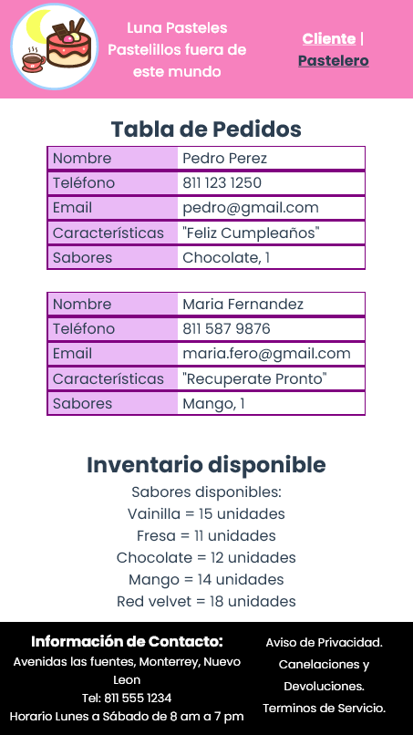

# Practica Vuex

## Objetivo
- Recrear la práctica Pasteleria, pero utilizando el framework Vue JS, haciendo uso de componentes.
- Las entradas de formulario Cliente deben pasar al lado de la página del Pastelero como una nueva entrada en la Tabla de Pedidos. 

## Despliegue de la página
[Pagina Pasteleria](https://illustrious-granita-a790c2.netlify.app/#/)

## Capturas de Pantalla   

Vista Cliente   

    

Vista Pastelero   
    

Responsive version   
 

  