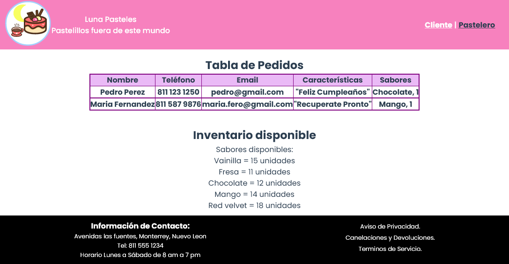

# Practica Vuex

## Objetivo
Recrear la práctica Pasteleria, pero utilizando el framework Vue JS

## Despliegue de la página
[Pagina Pasteleria](https://illustrious-granita-a790c2.netlify.app/#/)

## Capturas de Pantalla
Vista Cliente

Vista Pastelero

Vista mobile
